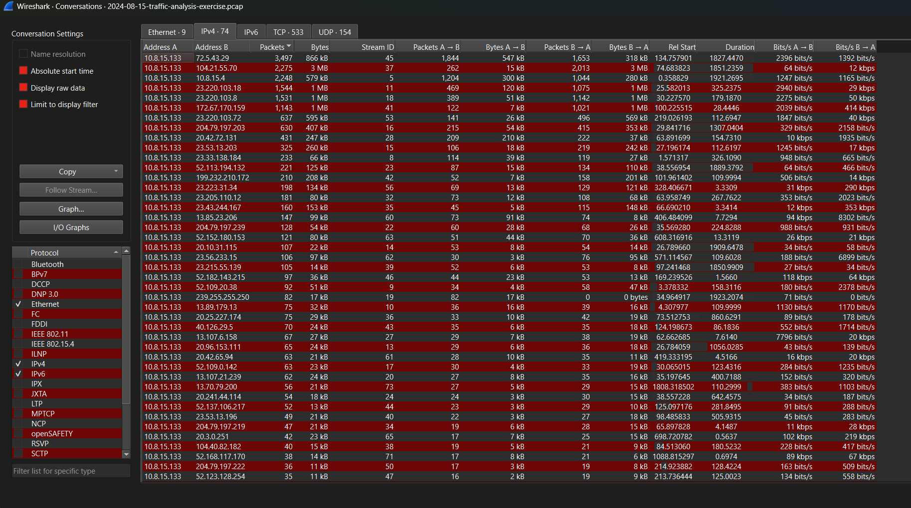
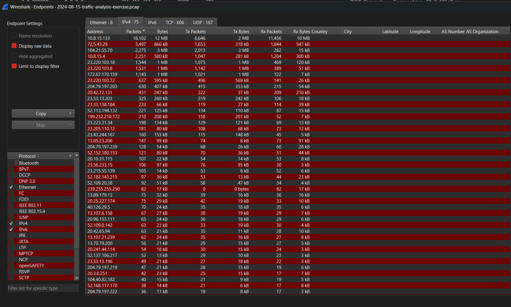
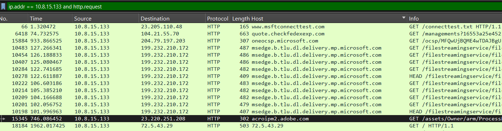
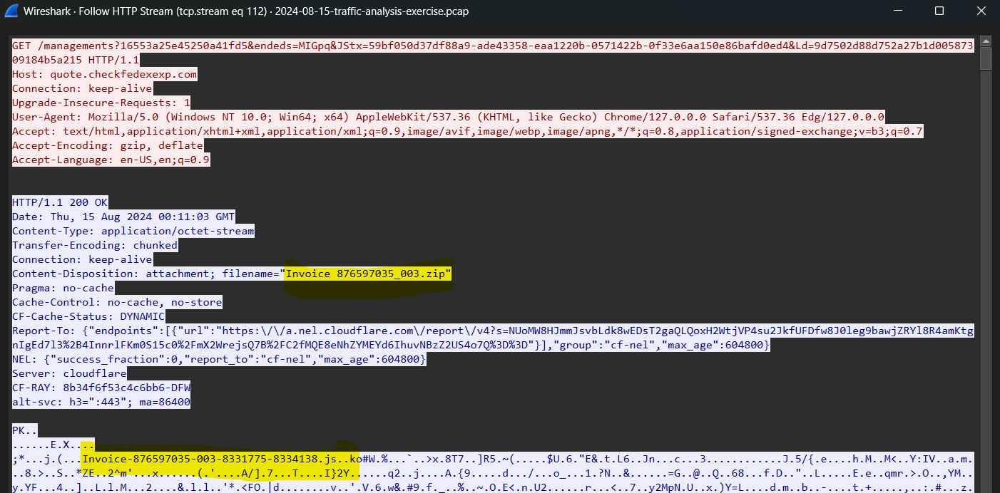

# Case: WarmCookie (Simulated Example)

This lab exercise demonstrates the capture and analysis of network traffic using Wireshark, with a focus on identifying suspicious activity and understanding packet communication.

---
# 1. Investigation Context (Lab Scenario)

This section describes the provided environment and network baseline used during the investigation.

---

## Background

A Windows host was infected, and it seems to be from WarmCookie malware.

---

##  Scenario

LAN segment details:

- LAN segment range:  10.8.15[.]0/24 (10.8.15[.]0 through 10.8.15[.]255)
- Domain:  lafontainebleu[.]org
- Active Directory (AD) domain controller:  10.8.15[.]4 - WIN-JEGJIX7Q9RS
- AD environment name:  LAFONTAINBLEU
- LAN segment gateway:  10.8.15[.]1
- LAN segment broadcast address:  10.8.15[.]255

##  Task

* Write an incident Report based on malicious network activity from the pcap and from the alerts. 

- The incident report should contains 3 sections:
> 	- **Executive Summary**: State in simple, direct terms what happened (when, who, what).
> 	- **Victim Details**: Details of the victim (hostname, IP address, MAC address, Windows user account name).
> 	- **Indicators of Compromise (IOCs)**: IP addresses, domains and URLs associated with the activity.  SHA256 hashes if any malware binaries can be extracted from the pcap.

# 2. Executive Summary

At 2024-08-14 19:11:04.072, Pierce Lucero attempted to download an attachment from an email. By doing so the user was redirected to a typosquatting website where malicious code was downloaded on his machine. By opening the malicious file his dekstop downloaded the WarmCookie malware. 

# 3. Victim Details

| Field       | Value             |
| ----------- | ----------------- |
| Hostname    | DESKTOP-H8ALZBV   |
| IP Address  | 10.8.15.133       |
| MAC Address | 00:1c:bf:03:54:82 |
| User        | Pierce Lucero     |

# 4. Timeline

| Time(UTC)              | Events                                                                        |
| ---------------------- | ----------------------------------------------------------------------------- |
| 2024-08-14 19:10:58:53 | Lucerno attemps to download attachment gets redirected to malicious website   |
| 2024-08-14 19:11:04:07 | First stage malware gets downloaded.                                          |
| 2024-09-04 19:12:00    | .js malicious file has been opened and begins to download warmcookie malware. |
|                        |                                                                               |

# 5. Methodology

Investigation conducted using Wireshark 4.6.4 and Virustotal on KaliVM. Following techniques were applied:
* Conversation analysis.

* Endpoint analysis.
  
* HTTP object export.
* IP and Protocol filtering.
 
* HTTP stream inspection.
 

# 6. Findings

### 6.1 Initial Access

The host attempts to download email attachment:
- Invoice 876597035_003.zip
  
- Gets redirected to quote[.]fedexexp.com where the malicious .zip file gets downloaded.

### 6.2 Second stage

Shortly after download, Pierce, attempts to open the .js file inside the zip. The file contacts 72[.]5.43.29, which in turn downloads a malicious .dll file. 

# 7. IOCs

| Type               | Indicator                                    |
| ------------------ | -------------------------------------------- |
| IP (infected host) | 10.8.15.133                                  |
| MAC Address        | 00:1c:bf:03:54:82,                           |
| Initial Domain     | quote.checkfedexexp[.]com (104[.]21[.]55.70) |
| Secondary contact  | 72[.]5.43[.]29                               |

# 8. File Hashes

- SHA256 of Invoice_876597035_003.zip: 798563fcf7600f7ef1a35996291a9dfb5f9902733404dd499e2e736ea1dc6fc5
- SHA256 of Invoice-876597035-003-8331775-8334138.js: dab98819d1d7677a60f5d06be210d45b74ae5fd8cf0c24ec1b3766e25ce6dc2c
- SHA256 of 0f60a3e7baecf2748b1c8183ed37d1e4 (ddl): b7aec5f73d2a6bbd8cd920edb4760e2edadc98c3a45bf4fa994d47ca9cbd02f6

# 9. Conclusion

The packet analysis confirms that Lucero's desktop (10.8.15.133) was compromised by the phishing and warmcookie backdoor. Suggested remedy is immediate containment and eradication. 
